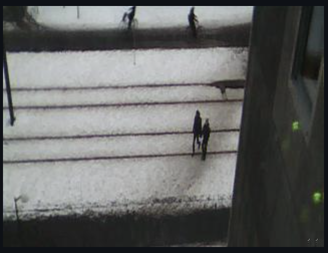
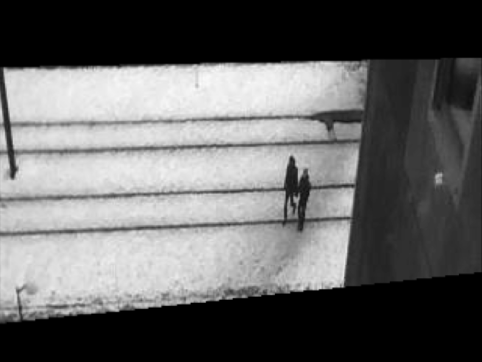
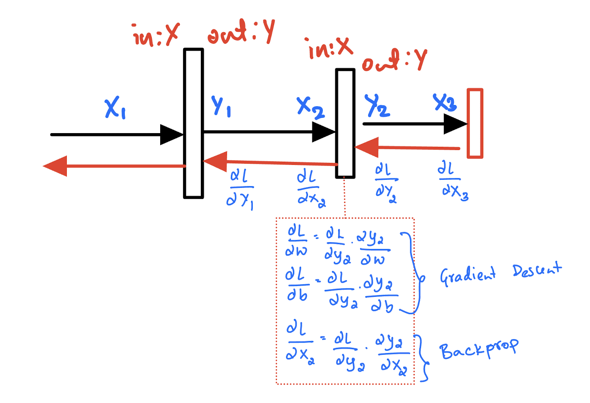

# Railway Anomaly Detection System (RADS)

### Project done as part of Machine Learning for Internet of Things (EITP40), Lund University, Sweden.

## Authors

- Alessandro Celoria
- Arshad Javeed
- Basim Elessawi
- Valentin Lopez Jimenez

## Supervisors

- Amir Aminifar, Associate senior lecturer at Broadband Communication, Lund University.
- [Baichuan Huang](https://github.com/whubaichuan), Doctoral student at Networks and Security, Lund University. 

## Demos

- Full demo: https://youtu.be/1eEcvNyESvY
- Short demo: https://youtu.be/KzASbsmRXew

# Data Preprocessing

- [Raw data](./images-data1/), hard to capture still/well-aligned images.

- Preprocessing of images is required so that the model is exposed to relevant information in the images.

- Since we are interested in detecting anomalies on the track, it makes sense to mask out the redundant portions of the image.

## Steps

1. Creating a mask: use edge detection and Hough transformation to detect horizontal and vertical lines in the images, solve the intersection and create a dynamic mask for each image.

1. Apply the mask.

2. Resize the image to make it compatible with the embedding model.

3. Code: [image generator](./client/generator.py).


### Before


### After



<!--  -->

# Neural Network Implementation



- An elegant neural network implementation from scratch.

- Layers implemented: [Linear](./platform/src/dnn/layers/linear.h), [ReLU](./platform/src/dnn/layers/relu.h), [Squared Loss](./platform/src/dnn/layers/squared.h). Supporting forward and backward propagation.

- Forward propagation: feed the input through the layers (left to right).

- Backpropagation: start computing the gradients (right to left), and accumulate the grads.
downstream grads = upstream grads * local grads, i.e. $\frac{dL}{dX} = \frac{dL}{dY} * \frac{dY}{dX}$

- And to help alleviate some of the convergence issues, we run a momentum stochastic gradient descent (SGD).

- Linear
    - Forward: $Y = W * X + b$
    - Backward: $\frac{\partial L}{\partial X} = W^\top * \frac{\partial L}{\partial Y}$
    - Grads: $\frac{\partial L}{\partial W} = \frac{\partial L}{\partial Y} * X^\top$, $\frac{\partial L}{\partial b} = \frac{\partial L}{\partial Y} * \vec 1$

- ReLU
    - Forward: $Y = \max(0, X)$
    - Backward: $\frac{\partial L}{\partial X} = \frac{\partial L}{\partial Y} \cdot \{X > 0\}$

- Squared Loss
    - Forward: $\text{loss} = \frac{1}{2}|| Y - \hat Y||_2^2$
    - Backward: $\frac{\partial L}{\partial Y} = Y - \hat Y$

## Autoencoder

Learn to reconstruct the embeddings.

Network architecture:

```
- - - - - 100 (embeddings) - - - - -

      - - 10    (Linear 1) - -
      - - ReLU             - -

        - 2     (Linear 2) -
        - ReLU             -

      - - 10    (Linear 3) - -
      - - ReLU             - -

- - - - - 100  (Linear 4) - - - - -
```

- Code: [network](./platform/src/dnn/network.cpp).

## Distributed Learning

1. Each agent would train on a subset of the data.

2. Synchronize the weights (averaging) after every epoch.

3. Repeat.

| **Hyperparameter** | **Value** |
|:------------------:|:---------:|
|     Batch Size     |     2     |
|      Momentum      |    0.2    |
|    Learning Rate   |   0.0001  |
|    Embedding Dim   |   100     |